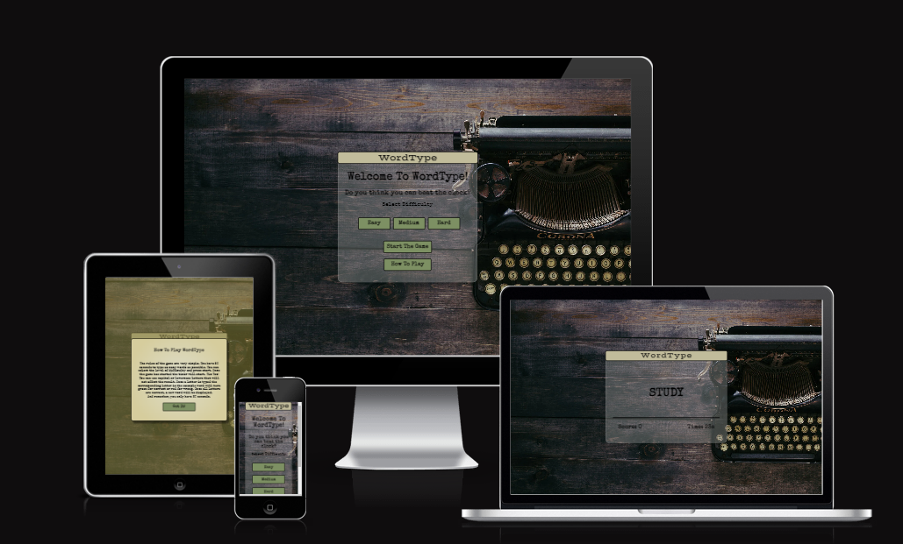
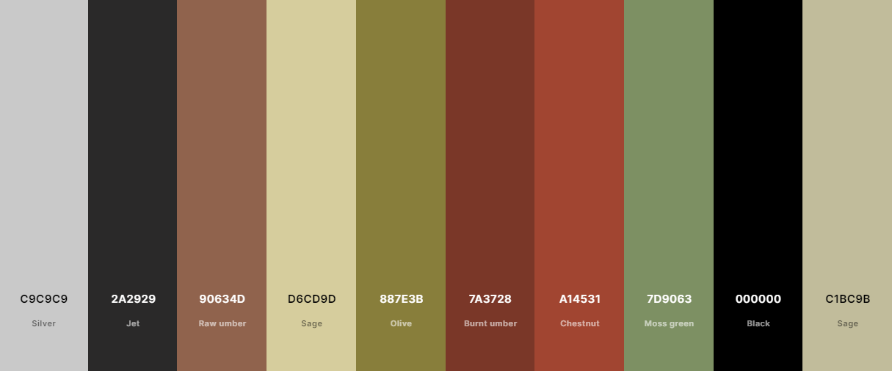
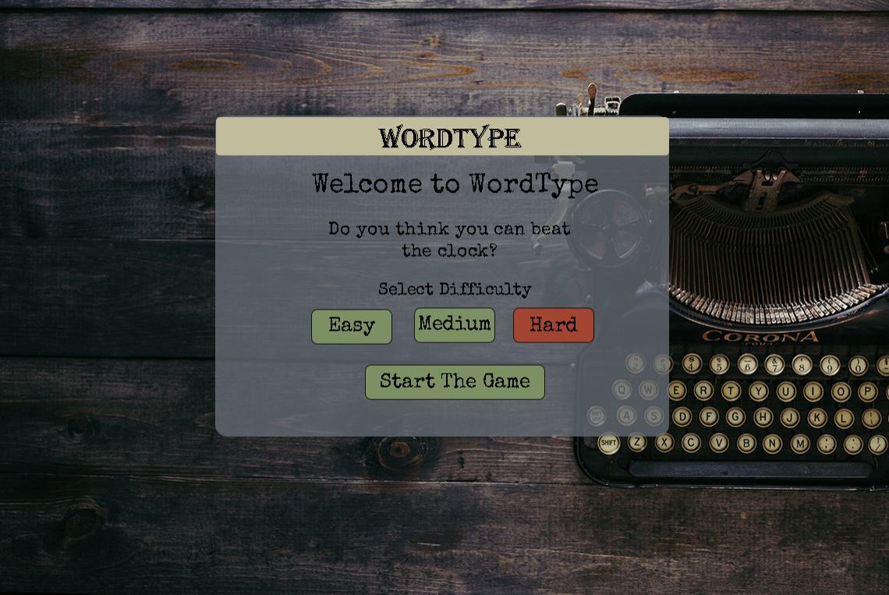
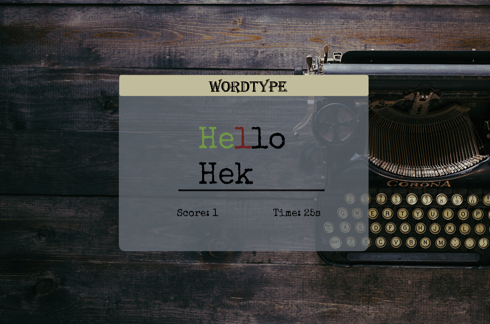
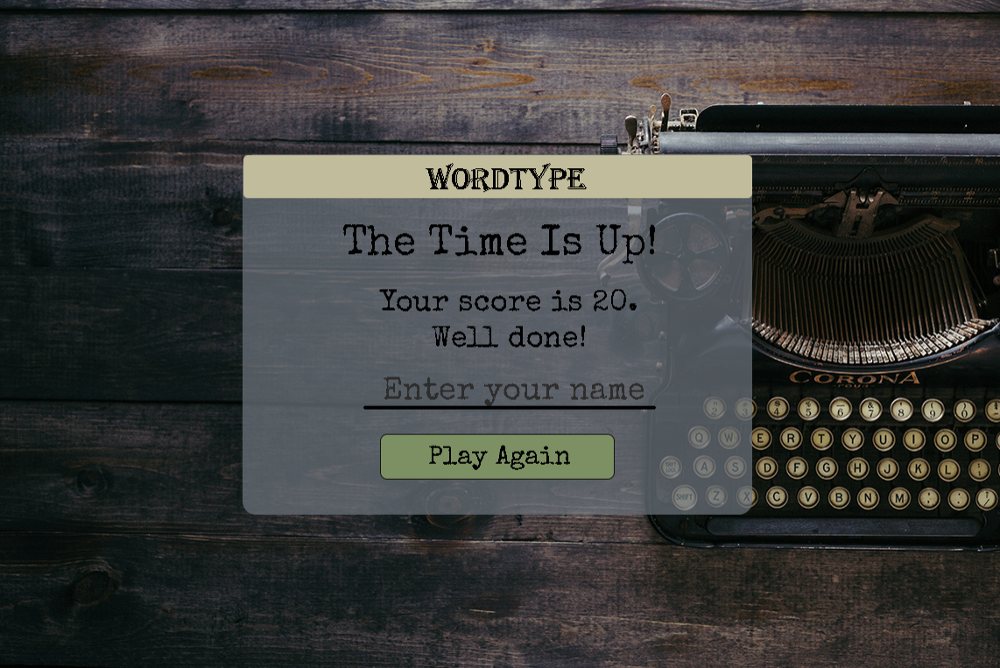
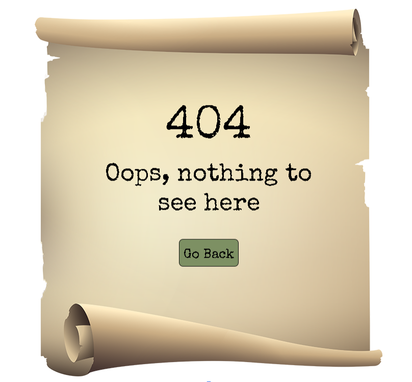

# Portfolio Project 2
## WordType
WordType is a speed typing game that allows the used to find out how many words they can type within 30 seconds. This project was created using HTML, CSS and JavaScript.  
[Link To WordType](https://dayana-n.github.io/portfolio-project-2-word-type/)

## Table Of Content
- [User Experience](#user-experience)
  - [User Stories](#user-stories)
- [Design](#design)
  - [Colour Scheme](#colour-scheme)
  - [Typography](#typography)
  - [Images](#images)
  - [Wireframes](#wireframes)
  - [Mockups](#mockups)
- [Features](#features)
  - [Index Page](#index-page)
  - [404 Page](#404-page)
- [Future Features](#future-features)
- [Testing](#testing)
- [Technologies And Languages](#technologies-and-languages)
- [Deployment](#deployment)
  - [Creating A Fork](#creating-a-fork)
  - [Cloning Repository](#cloning-repository)
- [Credits](#credits)
  - [Media](#media)
  - [Code](#code)
  - [Acknowledgements](#acknowledgements)
  - [Comments](#comments)

## User Experience
### User Stories
#### First Time Visitor Goals
#### Returning Visitor Goals
## Design
### Colour Scheme
The colours used complement each other for aesthetically pleasing user interface. 

### Typography
The fonts used are from [Google Fonts](https://fonts.google.com/share?selection.family=Special%20Elite%7CVast%20Shadow). 
Special Elite imitates typewritter font which fits perfectly with the theme of the game. Vast Shadow was used to create the logo in the header.
### Images
There are two images used in the game. The background image fits wll with the theme of the game and the typewritter font. The papyrus image on the 404 page was selected to provide better visual experience. Links to both can be found in Credits section.
### Wireframes
### Mockups
Early mockups using Photoshop. These were created to provide visual guide for coding the structure of the website. Later on during development additional screens were added for the highscore function and the how to play modal on the welcome screen. 
### Welcome Screen

### Game Screen

### End Game Screen

### 404 Page

## Features
## 404 Page
## Future Features 
## Testing
Testing documentation can be found under [testing.md](/testing.md)
## Technologies and languages
- [HTML](https://web.dev/learn/html/overview/) was used to provide structure for this project
- [CSS](https://developer.mozilla.org/en-US/docs/Web/CSS) was used to style the HTML elements
- [JavaScript](https://www.javascript.com/) was used to make the game interactive
- [GitHub](https://github.com/) is the hosting site used to store the code for the website
- [Git](https://git-scm.com/) was used as a version control software to commit and push the code to the GitHub repository
- [Code Institute Template](https://github.com/Code-Institute-Org/gitpod-full-template) was used as a starting point for the project
- [Photoshop](https://www.adobe.com/ie/products/photoshop.html) was used for creating the mockup images of the website during planning stage
- [Balsamiq](https://balsamiq.com/) was used to create the wireframes for the website
- [Favicon](https://favicon.io/) was used to create the favicon which displays in the tab of the browser
- [Google Fonts](https://fonts.google.com/) was used to import fonts
- [Google Chrome Lighthouse](https://developers.google.com/web/tools/lighthouse) was used during the testing of the website
- [Google Chrome Developer Tools](https://developer.chrome.com/docs/devtools/overview/) was used during testing, debugging and making the website responsive
- [W3C HTML Validator](https://validator.w3.org/) was used to check for errors in the HTML code
- [W3C CSS Validator](https://jigsaw.w3.org/css-validator/) was used to check for errors in the CSS code
- [Js Hint](https://jshint.com/) was used to validate the JavaScript code.
- [Online Convert](https://image.online-convert.com/convert-to-webp) used to convert images to webp format
- [Coolors.co](https://coolors.co/) was used to display the colour scheme
## Deployment
1. Navigate to the [repository](https://github.com/Dayana-N/portfolio-project-2-word-type)
2. Click on Settings on the top.
3. Click on Pages on the menu on the left which will open GitHub Pages window.
4. From the drop down menu under source select deploy from branch.
5. From the drop down menu under branch select main, this tells GitHub which branch to use for the deployment. Click Save.
6. The page should refresh and the deployment link should appear.

### Creating a fork
1. Navigate to the [repository](https://github.com/Dayana-N/portfolio-project-2-word-type)
2. In the top-right corner of the page click on the fork button and select create a fork.
3. You can change the name of the fork and add description 
4. Choose to copy only the main branch or all branches to the new fork. 
5. Click Create a Fork. A repository should appear in your GitHub

### Cloning Repository
1. Navigate to the [repository](https://github.com/Dayana-N/portfolio-project-2-word-type)
2. Click on the Code button on top of the repository and copy the link. 
3. Open Git Bash and change the working directory to the location where you want the cloned directory. 
4. Type git clone and then paste the link.
5. Press Enter to create your local clone.

## Credits
### Media 
- Background Image [Unsplash](https://unsplash.com/photos/0gkw_9fy0eQ)
- Papyrus image [Creative Fabrica](https://www.creativefabrica.com/product/old-scroll-paper-banner/)
### Code
- Learned how to compare the input letters with the current word from this tutorial [Build A Speed Typing Game](https://www.youtube.com/watch?v=R-7eQIHRszQ&list=PLxnCuGwyPyCoTmN3sX6KY80YXKiJMnXFR&index=39)
- Disable submit button when input field is empty [Stackoverflow](https://stackoverflow.com/questions/7067005/disable-button-whenever-a-text-field-is-empty-dynamically)
- Learned how to create modal popup [w3schools](https://www.w3schools.com/howto/howto_css_modals.asp)
- Learned how to use local storage for storing highscores from this [tutorial](https://www.youtube.com/watch?v=jfOv18lCMmw&t=306s)
- Learned how to create the typewritter text effect with the help of my mentor Ronan McClelland
- Improved my knowledge on arrow functions, for each, map, filter, setInterval and more from [Traversy Media's JavaScript course](https://www.traversymedia.com/modern-javascript-2-0) and [Harvard's Cs50 Course](https://www.youtube.com/playlist?list=PLhQjrBD2T380xvFSUmToMMzERZ3qB5Ueu)
### Acknowledgements
### Comments