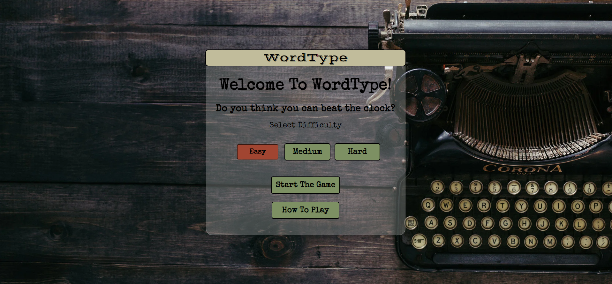
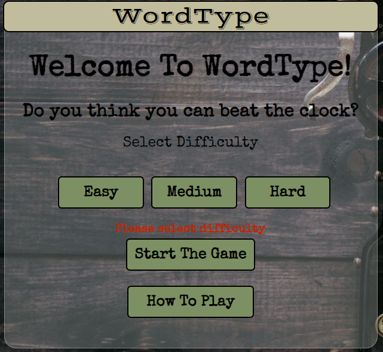
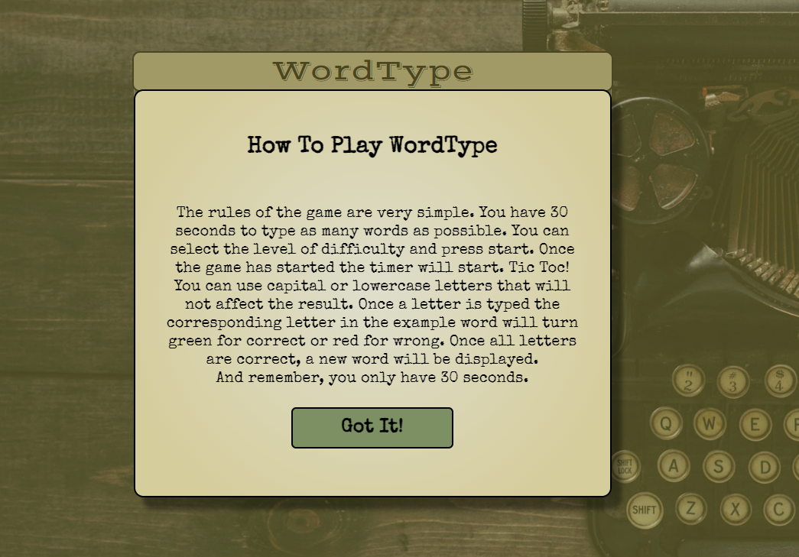
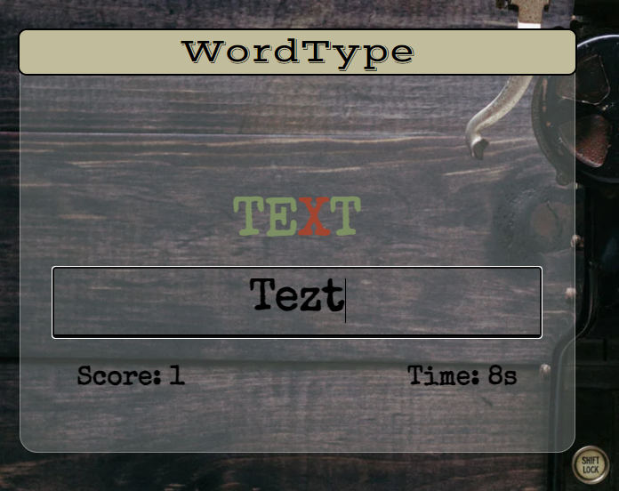
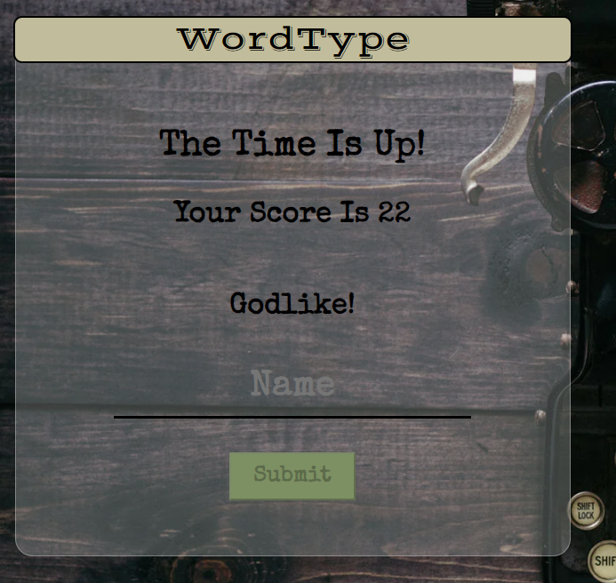
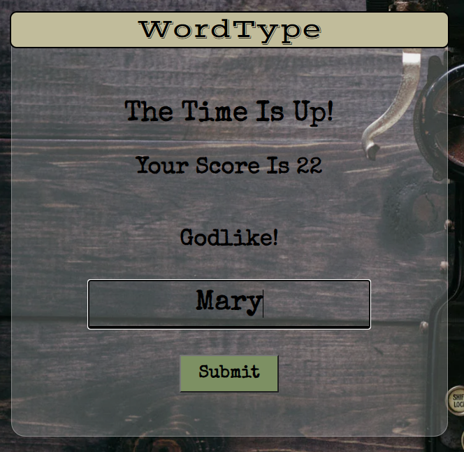
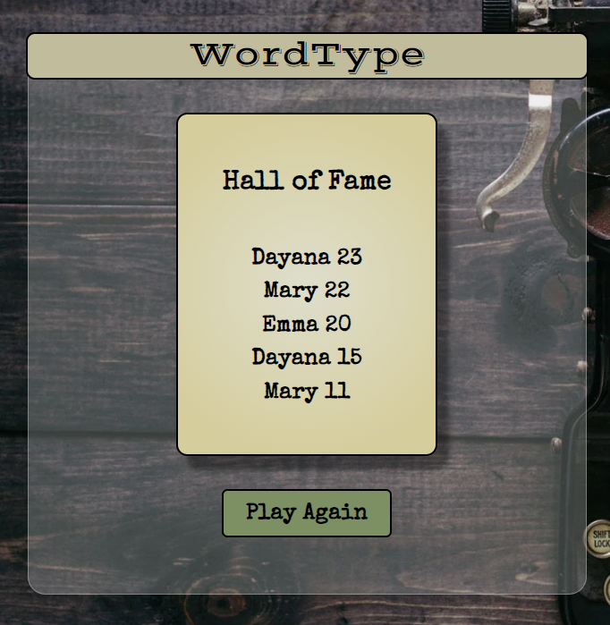
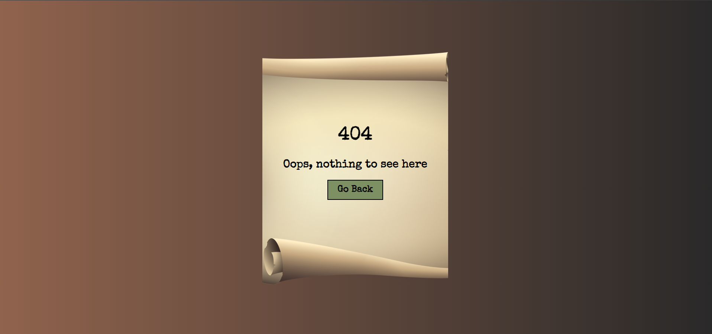

# Portfolio Project 2
## WordType
WordType is a speed typing game that allows the used to find out how many words they can type within 30 seconds. This project was created using HTML, CSS and JavaScript.  
[Link To WordType](https://dayana-n.github.io/portfolio-project-2-word-type/)

## Table Of Content
- [User Experience](#user-experience)
  - [User Stories](#user-stories)
- [Design](#design)
  - [Colour Scheme](#colour-scheme)
  - [Typography](#typography)
  - [Images](#images)
  - [Wireframes](#wireframes)
  - [Mockups](#mockups)
- [Features](#features)
  - [Index Page](#index-page)
  - [404 Page](#404-page)
- [Future Features](#future-features)
- [Testing](#testing)
- [Technologies And Languages](#technologies-and-languages)
- [Deployment](#deployment)
  - [Creating A Fork](#creating-a-fork)
  - [Cloning Repository](#cloning-repository)
- [Credits](#credits)
  - [Media](#media)
  - [Code](#code)
  - [Acknowledgements](#acknowledgements)
  - [Comments](#comments)

## User Experience
### User Stories
#### First Time Visitor Goals
- As a first time user, I want to easily understand the main purpose of the site.
- As a first time user, I want to be able to find the rules of the game quickly after landing on the page.
- As a first time user, I want to be able to select different difficulty levels for the game. 
- As a first time user, I want to be able to see my current score.
- As a first time user, I want to be able to see the remaining time left.
#### Returning Visitor Goals
- As a returning user, I want to be able to get a feedback when the game is over with my score.
- As a returning user, I want to be able to save my current highscore.
- As a returning user, I want to be able to see the top highscores. 
- As a returning user, I want to get a feedback during my interaction with the application.
## Design
### Colour Scheme
The colours used complement each other for aesthetically pleasing user interface. 

### Typography
The fonts used are from [Google Fonts](https://fonts.google.com/share?selection.family=Special%20Elite%7CVast%20Shadow). 
Special Elite imitates typewritter font which fits perfectly with the theme of the game. Vast Shadow was used to create the logo in the header.
### Images
There are two images used in the game. The background image fits wll with the theme of the game and the typewritter font. The papyrus image on the 404 page was selected to provide better visual experience. Links to both can be found in Credits section.
### Wireframes
### Mockups
Early mockups using Photoshop. These were created to provide visual guide for coding the structure of the website. Later on during development additional screens were added for the highscore function and the how to play modal on the welcome screen. 
### Welcome Screen

### Game Screen

### End Game Screen

### 404 Page

## Features
## Welcome Screen
The game consist of one html page with dynamically changing screens using JavaScript and one 404 page.
The background image was picked carefully to suit the theme of the game. When the page is loaded the welcome text loads with typewritter like effect. The name of the game is clearly communicated in the header of the main container. The difficulty buttons were design so that only one can be active at a time, and if it is active and clicked again will turn inactive. The active state is visually communicated to the user by changing color, reducing size and changing the border style, which overall makes the button appear as if it is pressed. This is consistent for all the buttons throughout the game.  

If the user attempts to start the game without selecting difficulty a warning message appears above the start button asking the user to select difficulty first.  

The how to play button displays a modal popup with animation transition, which provides clear instructions of the game's rules for better user experience. When the modal is displayed the scroll on the main page is disabled and it is enabled on the modal section only if it is needed(for example small screen sizes like iphone 4) If the user clicks outside of the modal it will close it.  

## Game Screen
Once the game starts, the game screen will dynamically appear. This screen will display the word that the user needs to type. The input field has autofocus for better user experience (prevents the user having to click on the input field to start typing). Below the input field, the score and the timer are displayed. The timer starts counting down from 30s. When the user starts typing, each input character is compared to the word's character at the same index. If correct the character will turn green, if wrong turns red to communicate to the user the wrong input. Note that the user can use capital letters or lowercase letters. If the user removes a character from the input field the character in the word will turn black again. Every time the user types a word correct the next word will appear and the score will increment by one.  

## End Game Screen
Once the timer reaches zero, the screen changes to end game. Here the user will be notified that the time is up and their score. A message is generated depending on the score value. Three messages are available: You Should Practice More!, Well Done! and Godlike! This if followed by an input field for the user's name. The submit button is deactivated until there is text in the input field. Once the submit button is pressed, the highscore is added to an array and sorted by the highest score. The top 5 scores are saved in local storage.  

## Scoreboard
The scoreboard screen will display the top 5 highscores sorted from highest to lowest. This is then followed by a play gain button, which takes the user to the start screen.  

## 404 Page
The 404 Page consist of a background gradient with a papyrus image. The text informs the user that there is nothing on this page and has a button which leads to the start screen.  

## Future Features 
- I would like implement saving the highscores in a backend database, where the users can compare their score against others.
- I would like to generate the words using an API. This was not implemented on this stage due to time deadline. 
## Testing
Testing documentation can be found under [testing.md](/testing.md)
## Technologies and languages
- [HTML](https://web.dev/learn/html/overview/) was used to provide structure for this project.
- [CSS](https://developer.mozilla.org/en-US/docs/Web/CSS) was used to style the HTML elements.
- [JavaScript](https://www.javascript.com/) was used to make the game interactive.
- [GitHub](https://github.com/) is the hosting site used to store the code for the website.
- [Git](https://git-scm.com/) was used as a version control software to commit and push the code to the GitHub repository.
- [Code Institute Template](https://github.com/Code-Institute-Org/gitpod-full-template) was used as a starting point for the project.
- [Photoshop](https://www.adobe.com/ie/products/photoshop.html) was used for creating the mockup images of the website during planning stage.
- [Balsamiq](https://balsamiq.com/) was used to create the wireframes for the website.
- [Favicon](https://favicon.io/) was used to create the favicon which displays in the tab of the browser
- [Google Fonts](https://fonts.google.com/) was used to import fonts.
- [Google Chrome Lighthouse](https://developers.google.com/web/tools/lighthouse) was used during the testing of the website.
- [Google Chrome Developer Tools](https://developer.chrome.com/docs/devtools/overview/) was used during testing, debugging and making the website responsive.
- [W3C HTML Validator](https://validator.w3.org/) was used to check for errors in the HTML code.
- [W3C CSS Validator](https://jigsaw.w3.org/css-validator/) was used to check for errors in the CSS code
- [Js Hint](https://jshint.com/) was used to validate the JavaScript code.
- [Online Convert](https://image.online-convert.com/convert-to-webp) used to convert images to webp format
- [Coolors.co](https://coolors.co/) was used to display the colour scheme.
- [Box Shadow Generator](https://cssgenerator.org/box-shadow-css-generator.html) was used to generate the shadow for the highscore container.
- [Glassmorphism CSS Generator](https://css.glass/) was used to generate the holding container's colours, however it was changed by removing the blurr.
- [CSS Gradient](https://cssgradient.io/) was used to generate the 404 page background gradient, the modal container and the highscore container gradient properties.
- [Random Word Generator](https://randomwordgenerator.com/) was used to generate the words for the game.
## Deployment
1. Navigate to the [repository](https://github.com/Dayana-N/portfolio-project-2-word-type)
2. Click on Settings on the top.
3. Click on Pages on the menu on the left which will open GitHub Pages window.
4. From the drop down menu under source select deploy from branch.
5. From the drop down menu under branch select main, this tells GitHub which branch to use for the deployment. Click Save.
6. The page should refresh and the deployment link should appear.

### Creating a fork
1. Navigate to the [repository](https://github.com/Dayana-N/portfolio-project-2-word-type)
2. In the top-right corner of the page click on the fork button and select create a fork.
3. You can change the name of the fork and add description 
4. Choose to copy only the main branch or all branches to the new fork. 
5. Click Create a Fork. A repository should appear in your GitHub

### Cloning Repository
1. Navigate to the [repository](https://github.com/Dayana-N/portfolio-project-2-word-type)
2. Click on the Code button on top of the repository and copy the link. 
3. Open Git Bash and change the working directory to the location where you want the cloned directory. 
4. Type git clone and then paste the link.
5. Press Enter to create your local clone.

## Credits
### Media 
- Background Image [Unsplash](https://unsplash.com/photos/0gkw_9fy0eQ)
- Papyrus image [Creative Fabrica](https://www.creativefabrica.com/product/old-scroll-paper-banner/)
### Code
- Learned how to compare the input letters with the current word from this tutorial [Build A Speed Typing Game](https://www.youtube.com/watch?v=R-7eQIHRszQ&list=PLxnCuGwyPyCoTmN3sX6KY80YXKiJMnXFR&index=39)
- Disable submit button when input field is empty [Stackoverflow](https://stackoverflow.com/questions/7067005/disable-button-whenever-a-text-field-is-empty-dynamically)
- Learned how to create modal popup [w3schools](https://www.w3schools.com/howto/howto_css_modals.asp)
- Learned how to use local storage for storing highscores from this [tutorial](https://www.youtube.com/watch?v=jfOv18lCMmw&t=306s)
- Learned how to create the typewritter text effect with the help of my mentor Ronan McClelland
- Improved my knowledge on arrow functions, for each, map, filter, setInterval and more from [Traversy Media's JavaScript course](https://www.traversymedia.com/modern-javascript-2-0) and [Harvard's Cs50 Course](https://www.youtube.com/playlist?list=PLhQjrBD2T380xvFSUmToMMzERZ3qB5Ueu)
### Acknowledgements
### Comments