# WordType Testing Documentation
[Link to the game](https://dayana-n.github.io/portfolio-project-2-word-type/)  
[Link to GitHub Repository](https://github.com/Dayana-N/portfolio-project-2-word-type)

## Contents
* [User Story Testing](#user-story-testing)
* [Automated Testing](#automated-testing)
  * [The W3C Markup Validation Service](#the-w3c-markup-validation-service)
  * [The W3C CSS Validation Service](#the-w3c-css-validation-service)
  * [JSHint](#JSHint-Validation)
  * [Google Lighthouse](#google-lighthouse)
* [Manual Testing](#manual-testing)
  * [Features Testing](#features-testing)
  * [Browser Testing](#browser-testing)
  * [Responsiveness Testing ](#responsiveness-testing)
* [Bugs](#bugs)
  
## User Story Testing
### As a first time user, I want easily understand the main purpose of the website.
- The header WordType and the subheader "Do you think you can beat the clock?" communicate to the user that the purpose of this website is a typing game. The background image with the typewriter serves as a fitting visual component that complements the website's purpose.
### As a first time user, I want to be able to find the rules of the game quickly after landing on the page.
- The how to play button is displayed on the landing page and provides instructions for the user on the rules of the game. 
### As a first time user, I want to be able to select different difficulty levels for the game. 
- On the landing page there is a message "Select Difficulty" followed by the difficulty buttons easy, medium and hard. The game will not start without the user selecting the difficulty level.
### As a first time user, I want to be able to see my current score.
- The current score is displayed on the game screen, once the game begins. The score updates every time the user enters the correct word. The final score is displayed at the end of the game. 
### As a first time user, I want to be able to see the remaining time left.
- The timer displayed on the game screen starts once the game starts. The timer counts from 30 sec until it reaches 0 and this is when the game ends.
### As a first time user, I want to be able to easily navigate through the website.
- The navigation of the game is designed via buttons throughout the application. In the beginning of the game the user can select difficulty, how to play or start the game. Once the time is over on the main game screen the user is presented with a screen prompting them to enter their name followed by a submit button. This then takes the user to the scoreboard which is followed by the play again button which takes the user to the start screen. 
### As a first time user, I want to get feedback during my interaction with the application.
- The first point of feedback during interaction is on the start screen. If the user does not select difficulty before clicking start game a message appears saying "Please select difficulty"
- When the game begins, as the user is typing each character is compared to the current word and if it is correct the corresponding letter in the word turns green if not turns red. If incorrect, the user can delete the character to try again and the colour will return to black. 
- When the game has ended, the user is presented with a screen displaying their score and a message based on their result. Three messages are available: You Should Practise More!, Well Done! and Godlike! This is followed by an input field for the user's name. The submit button is deactivated until there is text in the input field.
### As a returning user, I want to be able to get feedback when the game is over with my score.
- When the game has ended, the user is presented with a screen displaying their score and a message based on their result. Three messages are available: You Should Practise More!, Well Done! and Godlike!
### As a returning user, I want to be able to save my current highscore.
- Every time the game has ended the user is asked to enter their name to be able to save their score. The score will display only if it is within the top five.
### As a returning user, I want to be able to see the top highscores. 
- Once the submit button is pressed, the highscore is added to an array and sorted by the highest score. The top 5 scores are saved in local storage and then displayed to the user on the next page.
## Automated Testing
### The W3C Markup Validation Service
- index.html  
The test showed two warnings. The text in these two headings is added via JavaScript. The first one to create the  typewriter-like effect on the welcome text and the second to display the random word for the game. 

### Result - Pass
- 404.html  
The Page showed no errors or warnings  
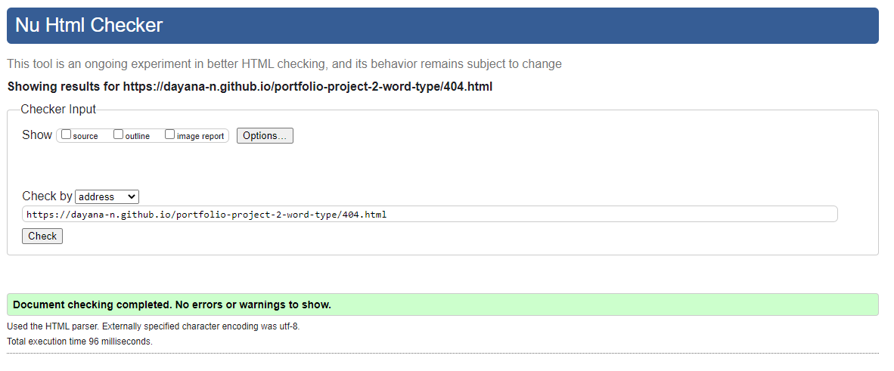
### Result - Pass
### The W3C CSS Validation Service
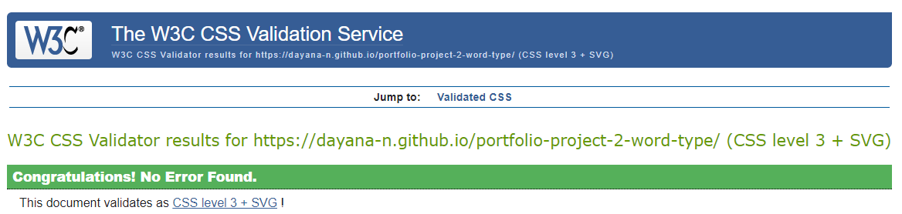
### Result - Pass
### JSHint Validation
- script.js and words.js were tested together. There were missing semicolons throughout the code and this was rectified. The validator caught a typo in one of the arrays used as a parameter in a function, which was also fixed. Currently no errors or warnings to display  
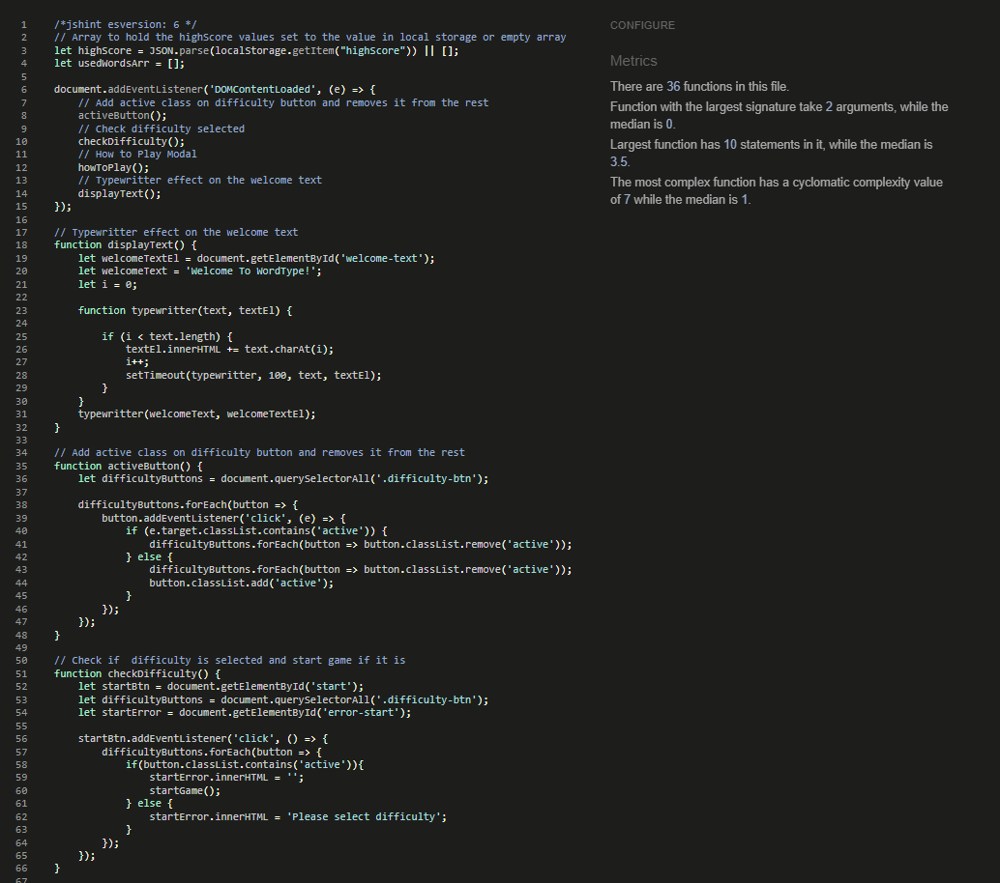
### Result - Pass

### Google Lighthouse
- index.html Desktop

### Result - Pass

- index.html Mobile

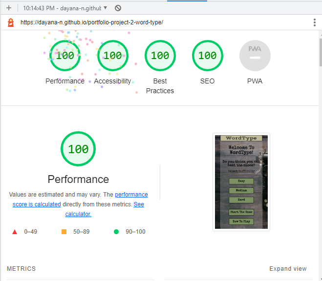
### Result - Pass

- 404.html Desktop 

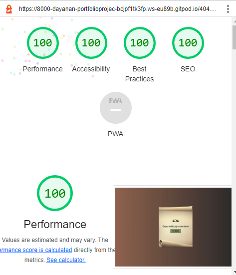
### Result - Pass

- 404.html Mobile

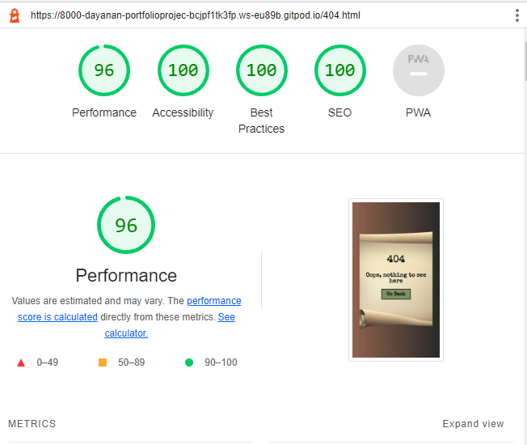
### Result - Pass

- Warning on all pages in the console  
This warning appears due to the fact that GitHub hosted pages disable FLoC, which is Google's 3rd party cookie alternative. - Source [Stackoverflow](https://stackoverflow.com/questions/69619035/error-with-permissions-policy-header-unrecognized-feature-interest-cohort) and [GithubBlog](https://github.blog/changelog/2021-04-27-github-pages-permissions-policy-interest-cohort-header-added-to-all-pages-sites/)  
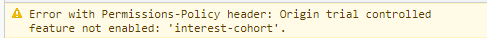
## Manual Testing
### Features Testing
The full testing document can be found [here](./assets/testing/features-testing.pdf). Please note that this is a pdf document and will require a program like Adobe Acrobat Reader DC to open it.  
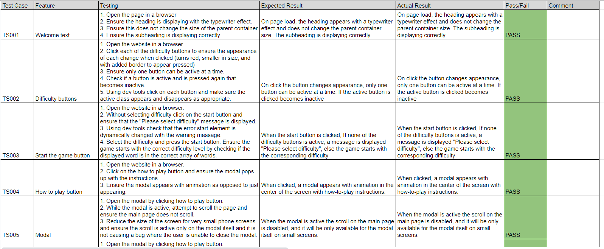
### Browser Testing
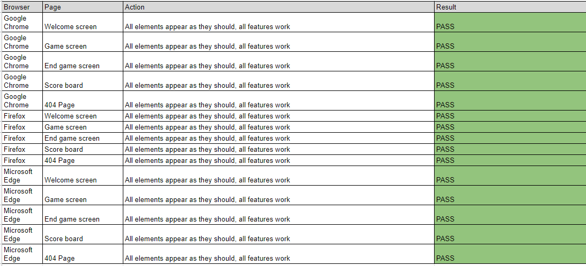
### Responsiveness Testing
The responsiveness of the application was tested using dev tools. During development, media queries were added to ensure the application is responsive for devices above 320px width. Two common sizes are documented below, however the application was tested on more than two screen sizes.
- Tested on Samsung Galaxy S20 Ultra  

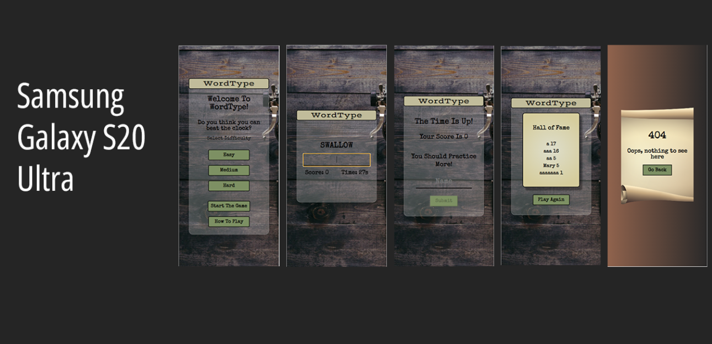
- Tested on IPad Mini  

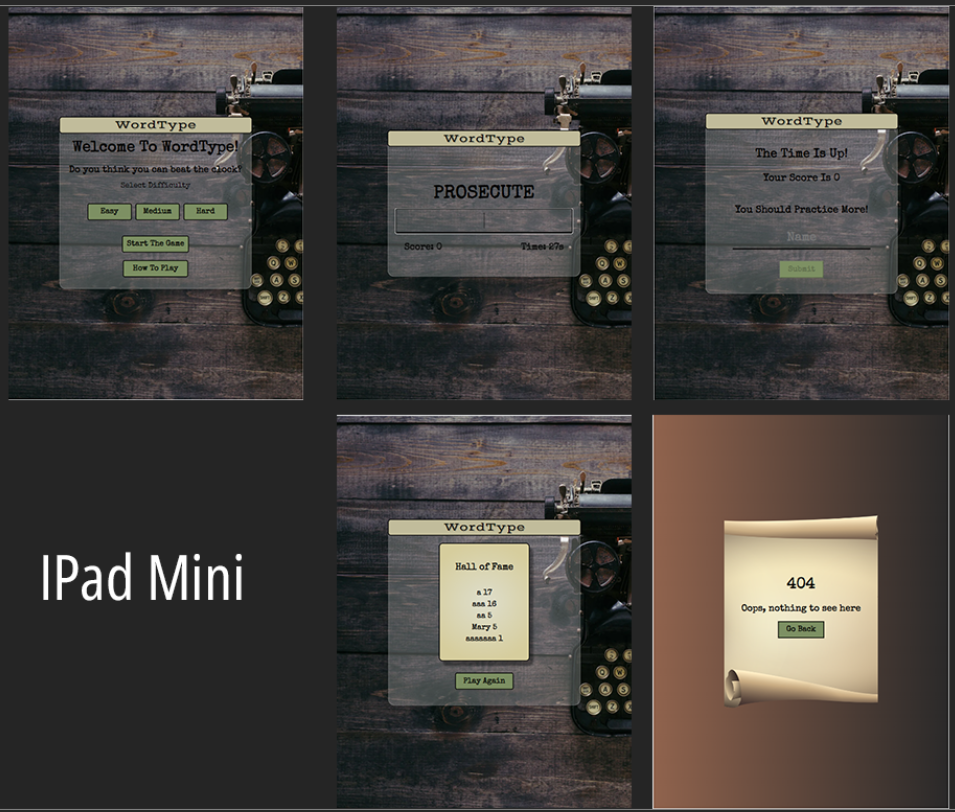
## Bugs
- During testing of the game, one of the words in medium difficulty was displayed with a comma at the end. This was easily fixed by removing the comma from the string.
- During testing of the JavaScript code with the validator it was noted on multiple lines that semicolons are missing. This was rectified by adding the missing semicolons to be consistent with the code.
- After the game was fully functionable it was noted that the random words repeat. While this is not a bug on its own, during the implementation of the solution a bug was created. The solution is to remove the word from the array and push it into an array called usedWords. In the unlikely event that the user runs out of words the game will continue using the words from the usedWords array. The bug was caused when the used word was pushed onto the array. It caused the score to be inaccurate and the Scoreboard displayed more than five scores. The steps taken were to console log each element along the way which showed that I was pushing array into array instead of a string. This was solved by using the spread operator. The bug was not documented in the commit messages due to the fact that the code was pushed after it was all tested and working. 
- After the game was made responsive it was noted that the display word appears too small on some mobile devices. The font size was changed on the corresponding screen sizes using media queries.
