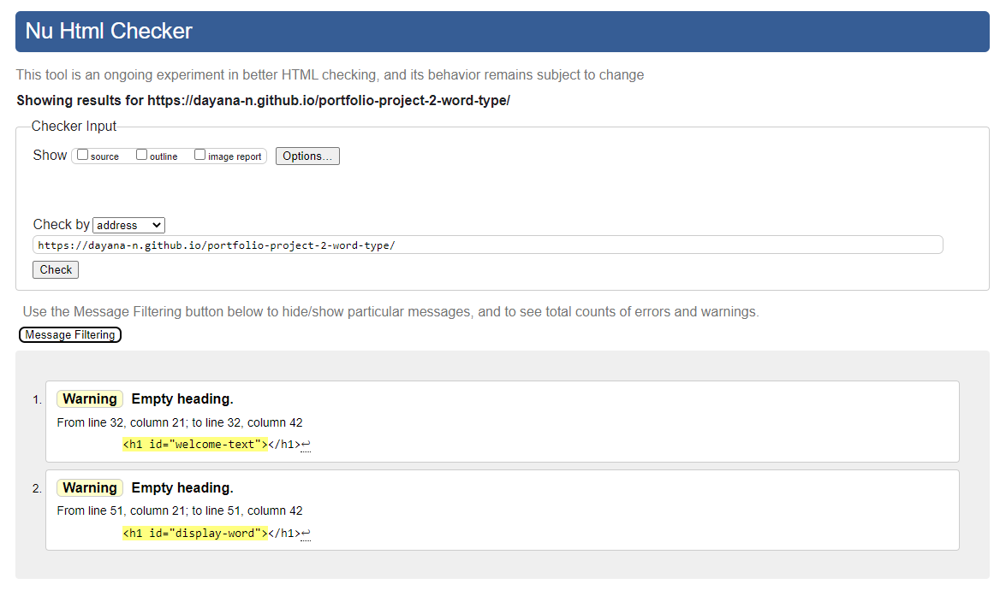
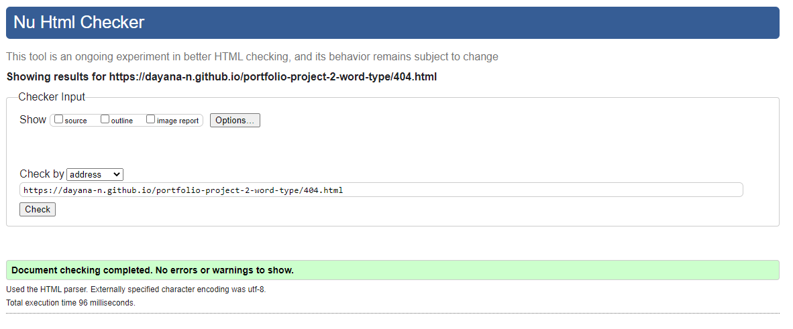
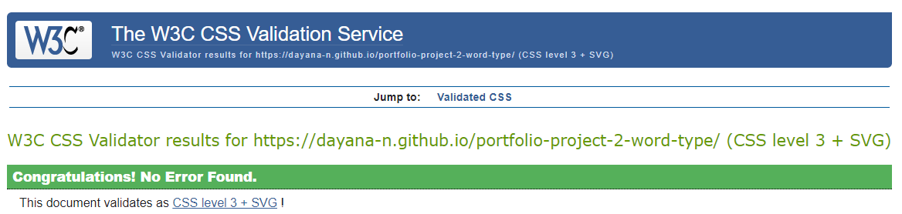
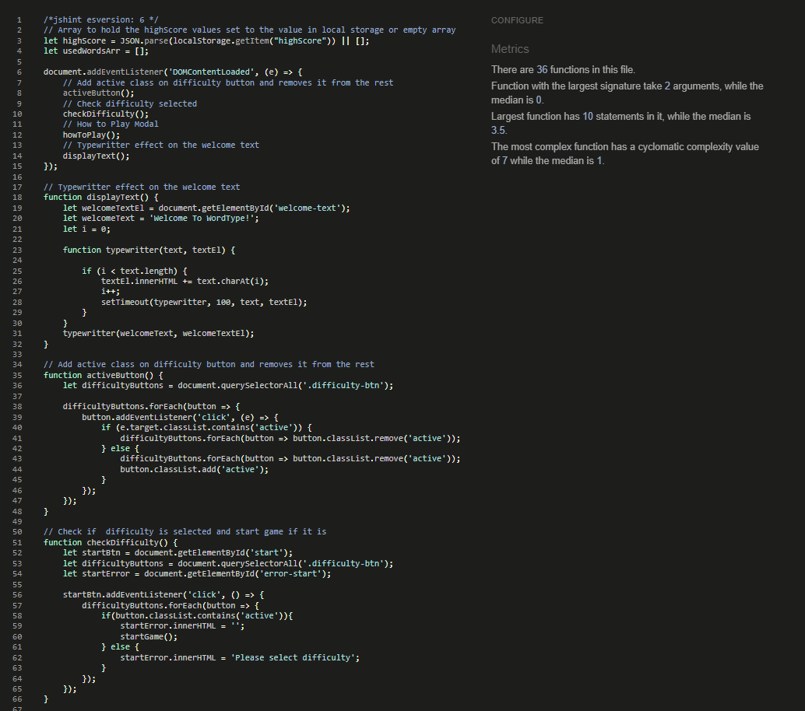
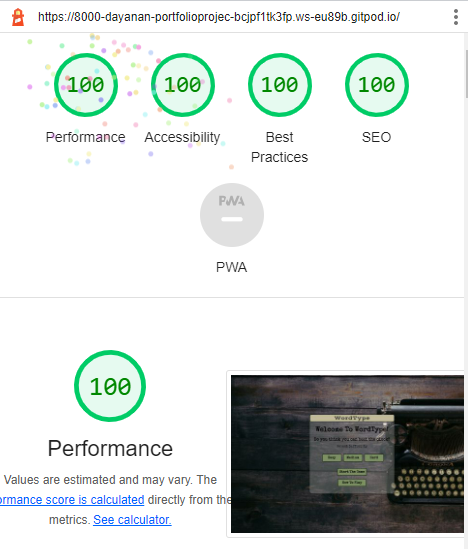
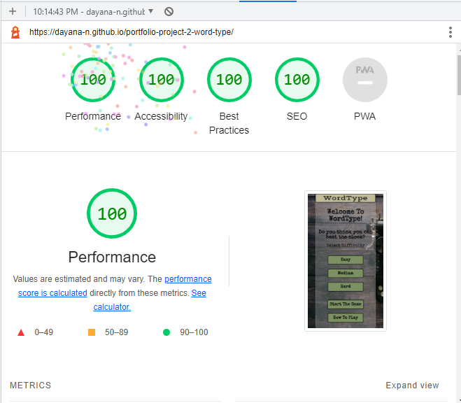
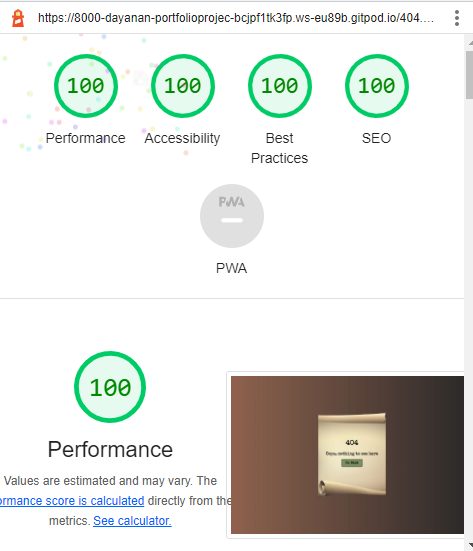
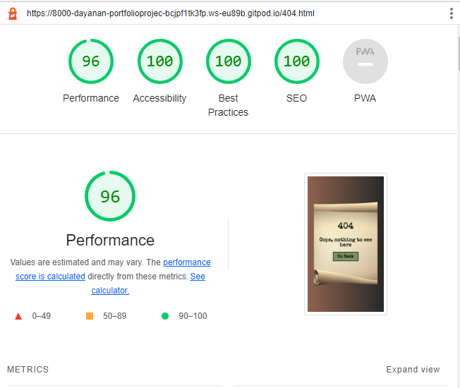

# WordType Testing Documentation
[Link to the game](https://dayana-n.github.io/portfolio-project-2-word-type/)  
[Link to GitHub Repository](https://github.com/Dayana-N/portfolio-project-2-word-type)

## Contents
* [User Story Testing](#user-story-testing)
* [Automated Testing](#automated-testing)
  * [The W3C Markup Validation Service](#the-w3c-markup-validation-service)
  * [The W3C CSS Validation Service](#the-w3c-css-validation-service)
  * [JSHint](#JSHint)
  * [Google Lighthouse](#google-lighthouse)
* [Manual Testing](#manual-testing)
  * [Features Testing](#features-testing)
  * [Browser Testing](#browser-testing)
  * [Responsiveness Testing ](#responsiveness-testing)
* [Bugs](#bugs)
  
## User Story Testing
### As a first time user, I want to be able to find the rules of the game quickly after landing on the page.
- The how to play button is displayed on the landing page and provides instructions for the user on the rules of the game. 
### As a first time user, I want to be able to select different difficulty levels for the game. 
- On the landing page there is a message "Select Difficulty" followed by the difficulty buttons easy, medium and hard. The game will not start without the user selecting difficulty level.
### As a first time user, I want to be able to see my current score.
- The current score is displayed on the game screen, once the game begins. The score updates every time the user enters correct word. The final score is displayed at the end of the game. 
### As a first time user, I want to be able to see the remaining time left.
- The timer displayed on the game screen starts once the game starts. The timer counts from 30 sec until it reaches 0 and this is when the game ends.
### As a first time user, I want to be able to easily navigate through the website.
- The navigation of the game is designed via buttons through out the application. In the beginning of the game the user can select difficulty, how to play or start the game. Once the time is over on the main game screen the user is presented with a screen prompting to enter their name followed by submit button. This then takes the user to the score board which is followed by play again button which takes the user to the start screen. 
### As a first time user, I want to get a feedback during my interaction with the application.
- The first point of feedback during interaction is on the start screen. If the user does not select difficulty before clicking start game a message appears saying "Please select difficulty"
- When the game begins, as the user is typing each character is compared to the current word and if it is correct the corresponding letter in the word turns green if not turns red. If incorrect the user can delete character to try again and the colour will return to black. 
- When the game has ended, the user is presented with a screed displaying their score and a message based on their result. Three messages are available: You Should Practice More!, Well Done! and Godlike! This if followed by an input field for the user's name. The submit button is deactivated until there is text in the input field.
### As a returning user, I want to be able to get a feedback when the game is over with my score.
- When the game has ended, the user is presented with a screed displaying their score and a message based on their result. Three messages are available: You Should Practice More!, Well Done! and Godlike!
### As a returning user, I want to be able to save my current highscore.
- Every time the has ended the user is asked to enter their name to be able to save their score. The score will display only if it is within the top five.
### As a returning user, I want to be able to see the top highscores. 
- Once the submit button is pressed, the highscore is added to an array and sorted by the highest score. The top 5 scores are saved in local storage and then displayed to the user on the next page.
## Automated Testing
### The W3C Markup Validation Service
- index.html  
The test showed two warnings. The text in these two headings is added via JavaScript. The first one to create the typewritter like efect on the welcome text and the second to display the random word for the game. 

### Result - Pass
- 404.html  
The Page showed no errors or warnings  

### Result - Pass
### The W3C CSS Validation Service

### Result - Pass
### JSHint Validation
- script.js and words.js were tested together. There were missing semicolons throughout the code and this was rectified. The validator cought a typo in one of the arrays used as a parameter in a function, which was also fixed. Currently no errors or warnings to display  

### Result - Pass

### Google Lighthouse
- index.html Desktop

### Result - Pass

- index.html Mobile

### Result - Pass

- 404.html Desktop 

### Result - Pass

- 404.html Mobile

### Result - Pass
